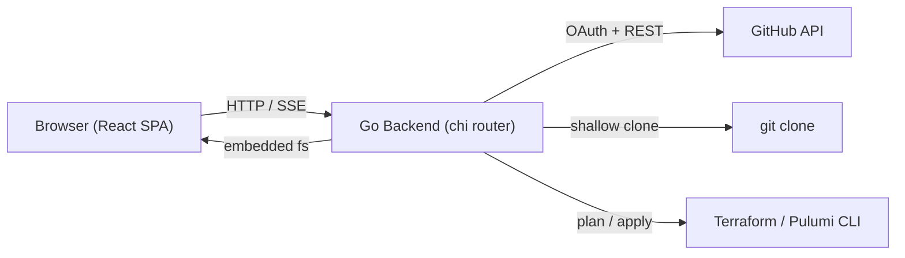
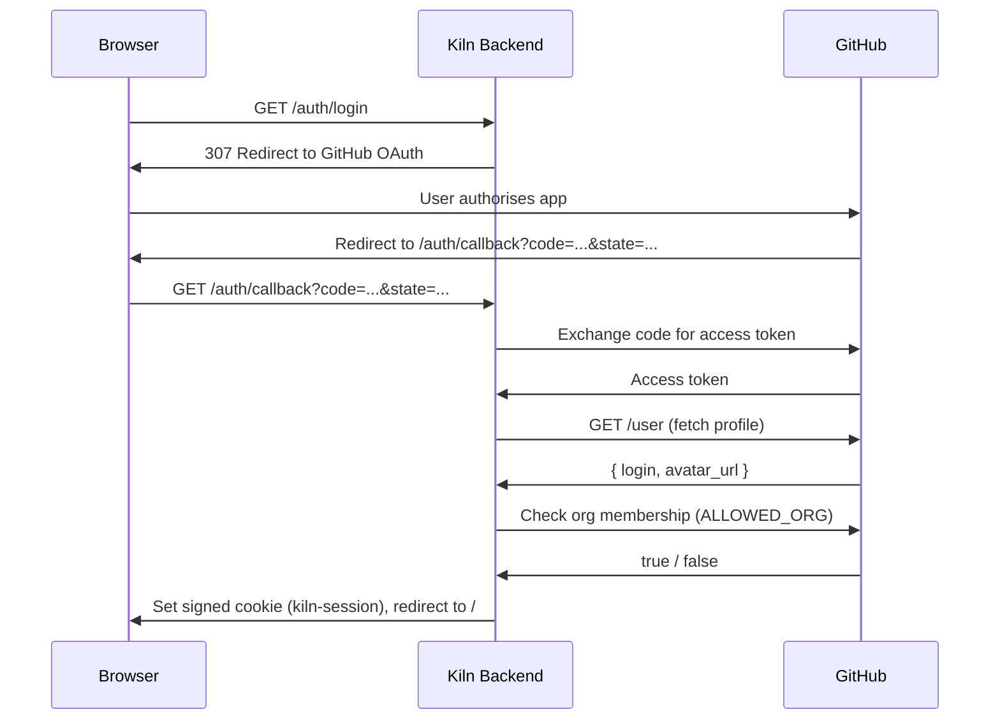
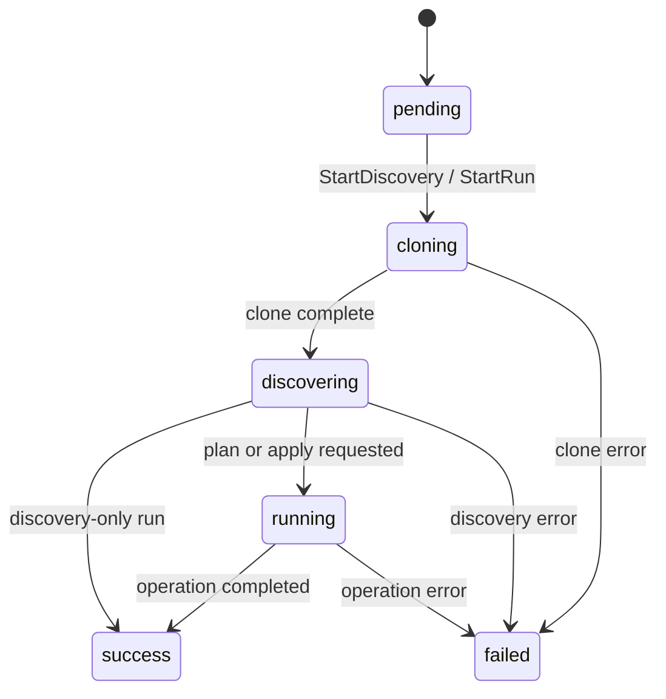
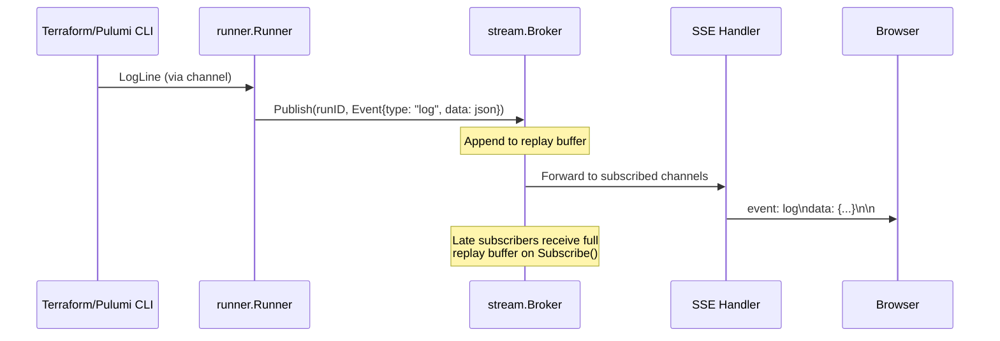

# Architecture

## High-Level Overview

Kiln is a Go HTTP server that serves an embedded React frontend and exposes a JSON API. The backend interacts with the GitHub API for authentication and PR data, clones repositories into temporary workspaces, discovers IaC projects, and orchestrates Terraform/Pulumi operations with real-time log streaming via Server-Sent Events.



## Authentication Flow

Users authenticate through GitHub OAuth. The backend verifies organisation membership before creating a signed session cookie.



In dev mode, `GET /auth/login` immediately creates a session for `dev-user` and redirects to `/` without contacting GitHub.

## Run Lifecycle

A run progresses through a state machine. Discovery-only runs (no operation specified) stop after the `discovering` phase. Full runs (plan or apply) continue through `running` to a terminal state.



## SSE Log Streaming

Log lines flow from the IaC engine through several layers before reaching the browser.



The broker maintains a per-run replay buffer so that clients connecting mid-run receive all previous events. Slow clients are dropped (non-blocking send) to prevent backpressure.

## Package Map

```
backend/
  cmd/kiln/              Entry point -- wires dependencies, starts HTTP server
  internal/
    config/              Load and validate env-var configuration
    auth/                OAuth handler, session store (signed cookies), auth middleware
    github/              GitHubClient interface + RealClient (go-github)
    git/                 WorkspaceManager interface + RealWorkspace (git clone)
    discovery/           Walk a directory tree to find Pulumi and Terraform projects
    engine/              Engine interface + Terraform/Pulumi implementations + auto-detect
    runner/              Run model, RunStore (in-memory), Runner orchestration
    stream/              SSE Broker (pub/sub with replay) and WriteSSE helper
    api/                 HTTP handlers and chi router
    devmode/             Mock implementations: MockGitHubClient, MockWorkspace, MockEngine
  static/                embed.FS for the frontend build output
  testdata/fake-infra/   Sample Pulumi + Terraform project for tests and dev mode
```

### `internal/config`

Loads all configuration from environment variables. Validates that required vars (`GITHUB_CLIENT_ID`, `GITHUB_CLIENT_SECRET`, `ALLOWED_ORG`) are set when `DEV_MODE` is not `true`. Parses the `REPOS` variable as a comma-separated list of `owner/name` pairs.

### `internal/auth`

Three components:

- **`OAuthHandler`** -- Handles `/auth/login`, `/auth/callback`, and `/auth/logout`. Uses `golang.org/x/oauth2` with the GitHub endpoint. Verifies organisation membership via the `GitHubClient.IsMember` method. In dev mode, `/auth/login` creates a `dev-user` session immediately.
- **`SessionStore`** -- Encodes/decodes sessions into HMAC-signed cookies using `gorilla/securecookie`. Stores `login` and `avatar` fields.
- **`RequireAuth` middleware** -- Reads the session cookie; returns 401 JSON if missing/invalid; otherwise injects the `Session` into the request context.

### `internal/github`

Defines the `GitHubClient` interface with methods: `ListOpenPRs`, `GetPR`, `GetApprovalStatus`, `IsMember`, `PostComment`. The `RealClient` implementation uses `google/go-github/v62` with a static OAuth2 token.

### `internal/git`

Defines the `WorkspaceManager` interface (`Allocate`, `CloneOrLink`, `Release`). The `RealWorkspace` implementation creates temp directories under a configurable base dir and performs shallow `git clone --depth 1 --branch <branch>`. The GitHub token is injected into the HTTPS URL for private repo access.

### `internal/discovery`

`DiscoverProjects` walks a directory and returns discovered IaC projects. Pulumi projects are found by locating `Pulumi.yaml` files and reading stack configs (`Pulumi.<stack>.yaml`). Terraform projects are found by locating directories containing `*.tf` files. Results are sorted by directory path.

### `internal/engine`

Defines the `Engine` interface (`Init`, `Plan`, `Apply`, `Name`). Implementations exist for both Terraform and Pulumi. `DetectEngine` auto-selects the engine based on file presence (`Pulumi.yaml` vs `*.tf`). Plan and Apply stream output through a `chan LogLine` with `Stream` (stdout/stderr), `Text`, and `Time` fields.

### `internal/runner`

- **`Run`** -- The run model with fields for repo, PR, project, stack, operation, status, and discovered projects.
- **`RunStore`** -- Thread-safe in-memory map of runs. Generates v4 UUIDs via `crypto/rand`.
- **`Runner`** -- Orchestrates the full lifecycle: allocate workspace, clone, discover, init, plan/apply. Publishes status changes and log lines to the broker. Runs asynchronously in goroutines.

### `internal/stream`

- **`Broker`** -- Per-run pub/sub with replay buffer. `Publish` appends to a buffer and fans out to subscribed channels (non-blocking). `Subscribe` returns a channel pre-loaded with all buffered events.
- **`WriteSSE`** -- Formats and flushes a single SSE event (`event: <type>\ndata: <data>\n\n`).

### `internal/api`

Chi router with middleware (request ID, real IP, logging, recovery, CORS). Routes:

| Method | Path | Auth | Description |
|---|---|---|---|
| GET | `/auth/login` | No | Start OAuth flow |
| GET | `/auth/callback` | No | OAuth callback |
| GET | `/auth/logout` | No | Clear session |
| GET | `/api/health` | Yes | Health check |
| GET | `/api/me` | Yes | Current user info |
| GET | `/api/repos` | Yes | List configured repos |
| GET | `/api/repos/{owner}/{repo}/prs` | Yes | List open PRs |
| POST | `/api/runs` | Yes | Create a run (discovery or plan/apply) |
| GET | `/api/runs/{id}` | Yes | Get run status |
| GET | `/api/runs/{id}/stream` | Yes | SSE stream of run events |
| GET | `/*` | No | Serve embedded frontend (SPA fallback) |

### `internal/devmode`

Mock implementations of all external dependencies:

- **`MockGitHubClient`** -- Returns deterministic fake PRs and always-true membership checks.
- **`MockWorkspace`** -- Symlinks to a local testdata directory instead of cloning.
- **`MockEngine`** -- Streams realistic-looking Terraform output with ANSI colours and 80ms delays.
